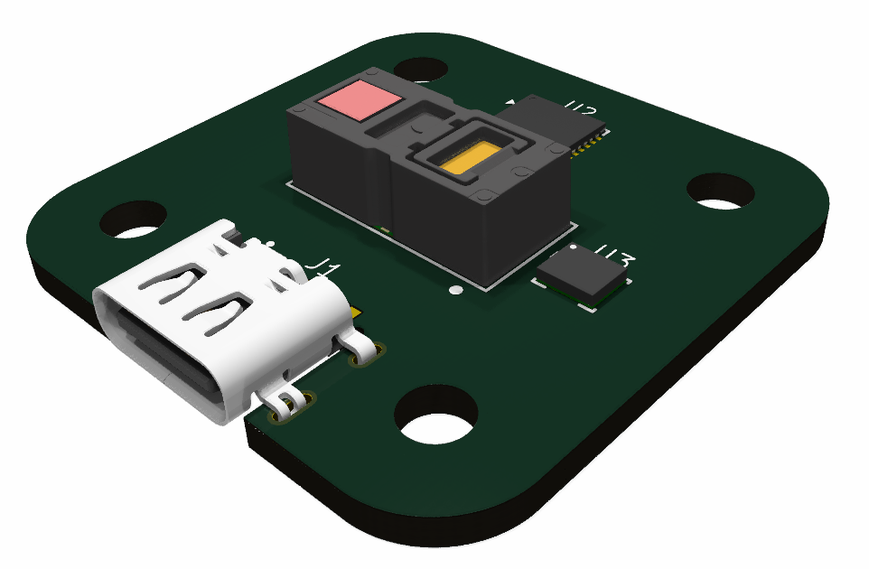
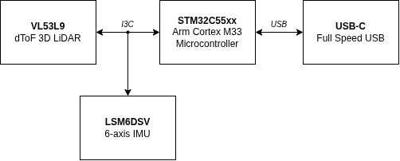

# USB-C LiDAR Node (VL53L9)

An compact and low-cost USB device with integrated LiDAR sensor and IMU. This hardware node packages STMicroelectronics' VL53L9 advanced direct Time-of-Flight (dToF) matrix LiDAR with a 6-axis IMU into a single-cable, plug-and-play USB-C device. Designed for mobile robotics, micro-UAVs, and academic SLAM research. 

## System Architecture

| Feature | Detail | Datasheet |
|---|---|---|
| **LiDAR** | ST VL53L9CX dToF module with up to 54×42 (2.3 k) discrete ranging zones, 5 cm–8.8 m range | [link](https://www.st.com/resource/en/datasheet/vl53l9cx.pdf)
| **IMU** | ST LSM6DSV 6-axis IMU with embedded sensor fusion engine, orientation quaternions generated on-chip | [link](https://www.st.com/resource/en/datasheet/lsm6dsv.pdf)

## Data Format
Raw binary packet framing is used instead of verbose text formats (JSON/CSV) to stay well within the 12 Mbps USB Full-Speed ceiling while imposing zero processing overhead on the MCU.

The 12.5 MHz I3C bus caps practical LiDAR extraction at ~40–50 fps at full resolution. Two pre-configured profiles balance resolution against USB endpoint limits:

| Profile | Output Matrix | Frame Rate | USB Bandwidth | Stability |
|---|---|---|---|---|
| **Full Resolution** *(default)* | 54 × 42 zones | 30 Hz | ~3.56 Mbps | Bulletproof |
| **Binned Navigation** *(high-velocity)* | 24 × 20 zones | 60 Hz | ~1.84 Mbps | Bulletproof |

> **IMU stream:** Even at 400 Hz sampling, the 6-axis raw registers plus quaternion packets total ~0.10 Mbps — continuous streaming has no measurable impact on LiDAR data.

## Mechanical Specs

To be defined. It will have a ¼"-20 threaded insert for a standard tripod interface. Preferably fits a 20x20mm pitch M3 drone frame stack.